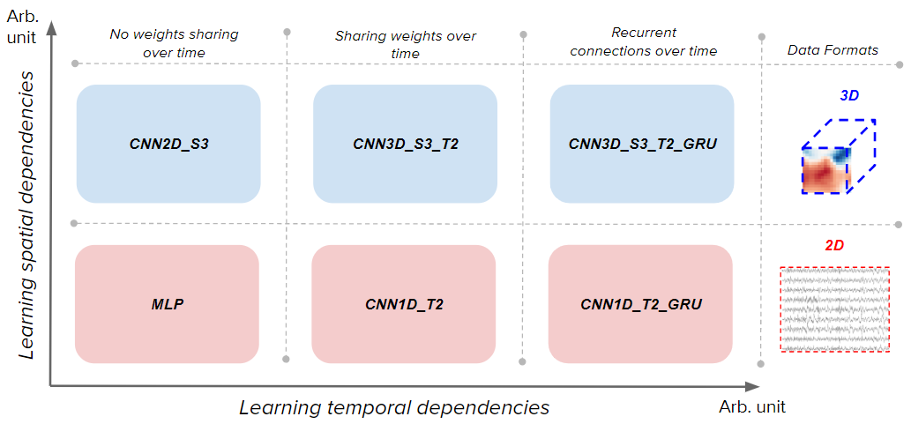
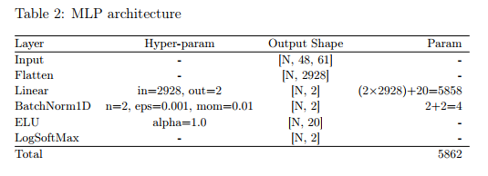
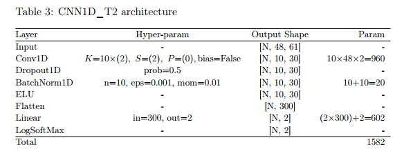
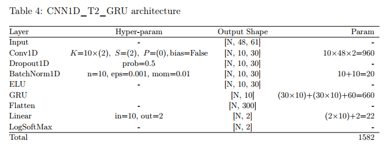
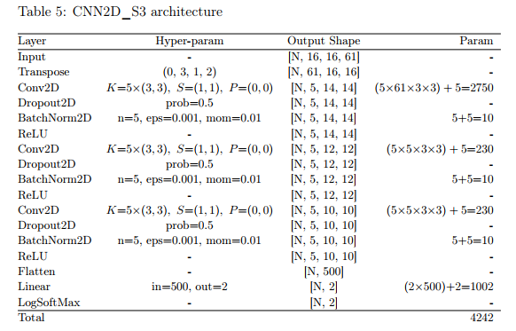

# Deep BCI study

To get the data, please send an email to loic.delobel@gmail.com

### Installation

- Install conda : https://conda.io/docs/user-guide/install/index.html
- Install PyTorch for your platform (CUDA not necessary) : https://pytorch.org/

```sh
$ git clone <this repo>
$ cd deep_bci_study
$ conda env create
$ source activate deep_bci
$ pip install -r requirements.txt
```

### Run

##### Data pre-rocessing

Pre-process the data with the following commands :

```sh
#RSVP dataset, 48 sensors (dont forget to edit load_step_1.py before)
python load_step_1.py --cache-dir /tmp/cache --output-dir /<DIR>/rsvp48
python load_step_2.py --input-dir /processed_data/rsvp48

#MEEG dataset, 48 sensors (dont forget to edit load_step_1.py before)
python load_step_1.py --cache-dir /tmp/cache --output-dir /<DIR>/meeg48
python load_step_2.py --input-dir /processed_data/rsvp48

#RSVP dataset, 48 sensors, TOPO format (dont forget to edit load_step_1.py before)
python load_step_1.py --cache-dir /tmp/cache --output-dir /<DIR>/rsvp48_topo
python load_step_2.py --input-dir /processed_data/rsvp48_topo
...
```

Generate the scenario files

```
python gen_scenario.py --base-path /processed_data --output-dir /scenarios
```

##### Run the models

Run one scenario (one subject) with one model and show test results (it's convenient for testing a model):
```
python deep_run_and_test.py --scenario /scenarios/rsvp48/VPfat.json --model 'mlp'
```

Run one scenario (one subject) with one model (no testing) :
```
python deep_run.py --scenario /scenarios/rsvp48/VPfat.json --model 'mlp'
```


Run one scenario for all subjects (run sequentially). Start by editing launch.py then :
```
#check with
python launch.py
#execute with
python launch.py --execute
```

##### Run the models on the local cluster


Connect to the local cluster:


```
ssh 10.69.111.81
```

Clone this gitlab repo and install all deps on the cluster. Data must be put in /mnt/data/<your_name>/ directory.

Run one scenario for all subjects on the local cluster. Start by editing launch.py then :
```
#check with
python launch.py --no-cluster
#execute with
python launch.py --no-cluster | sh
```

##### Models description








